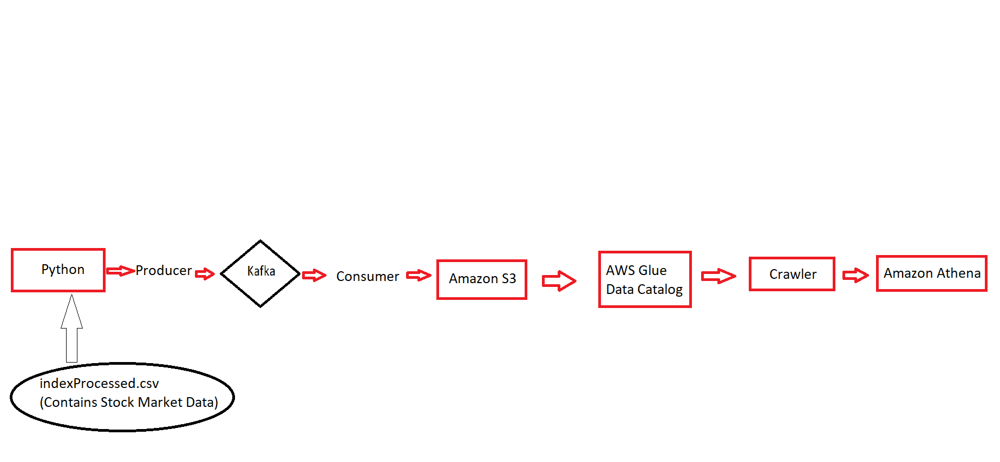

## Introduction

Designed and implemented a data pipeline using Kafka. The Kafka server is running on Amazon EC2. The producer sends data to the consumer using Kafka. The consumer receives the data and stores it in an Amazon S3 bucket. An Amazon crawler runs on this S3 bucket to analyze the data using Amazon Athena.

--- 
## Architecture

 

--- 
## Technology Used

-   Programming Language - Python
-   Amazon Web Service (AWS)

1.  S3 (Simple Storage Service)
2.  Athena
3.  Glue Crawler
4.  EC2

-   Apache Kafka
